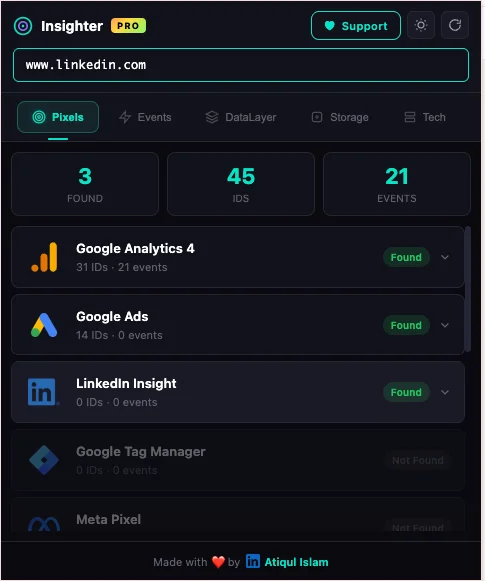
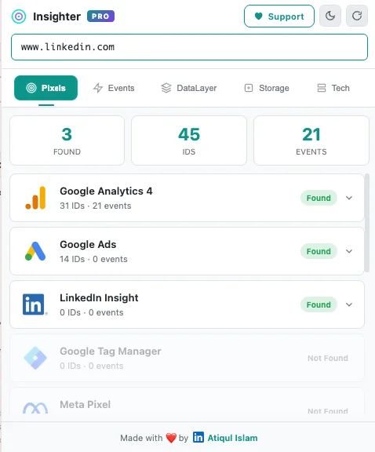
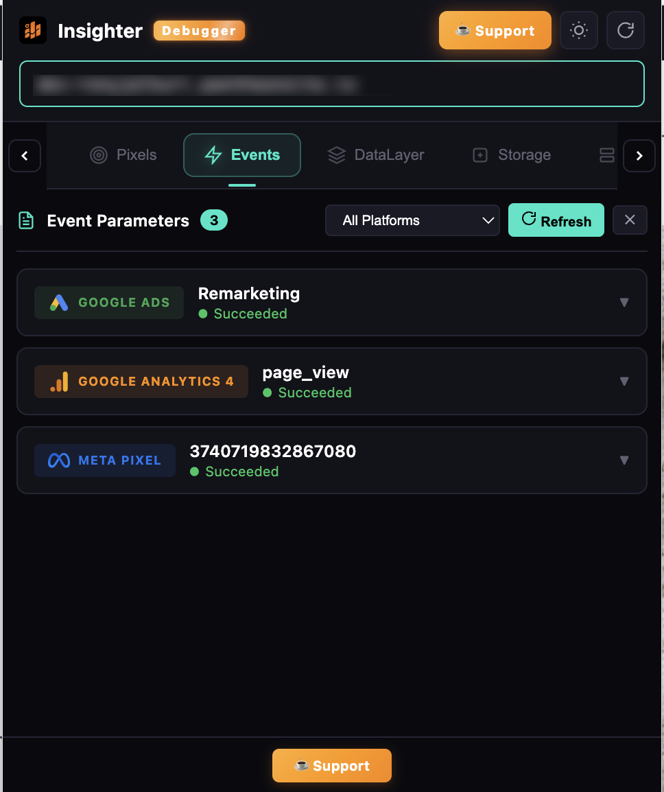
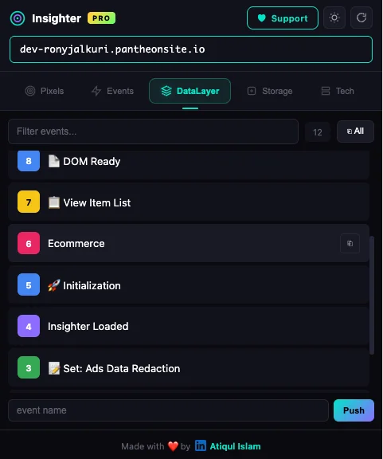
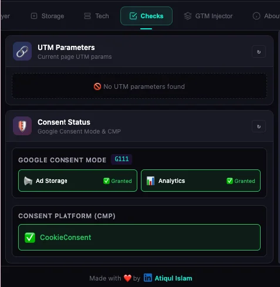
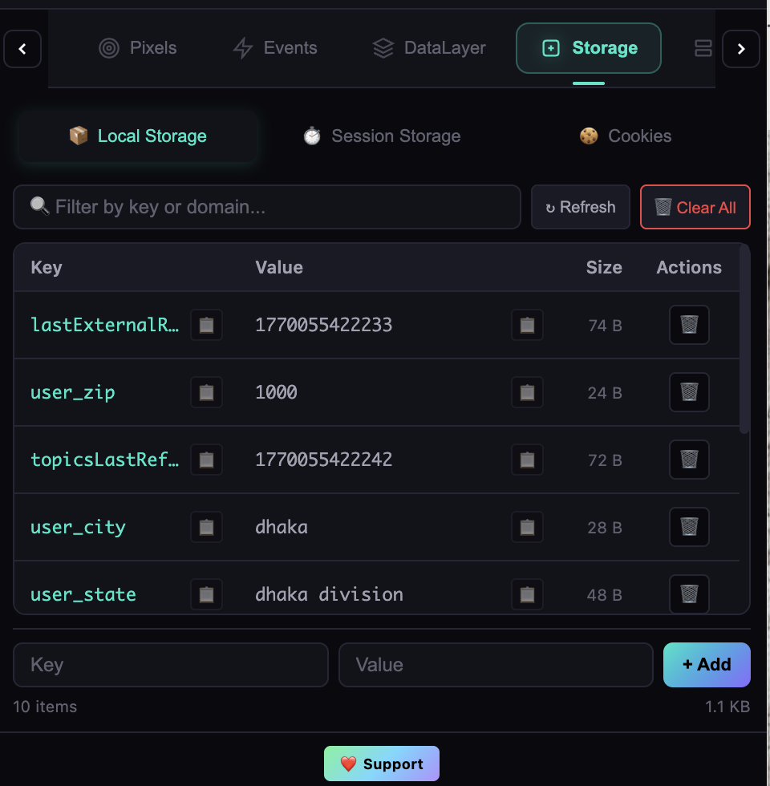
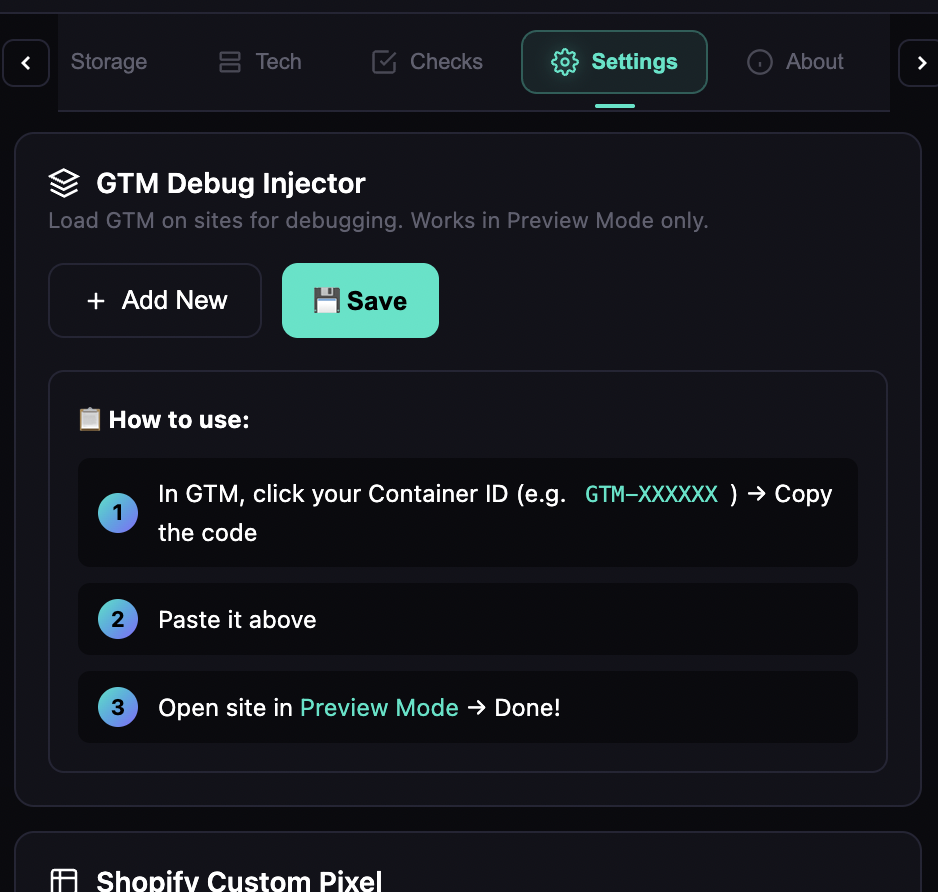

<!-- ═══════════════════════════════════════════════════════════════════ -->
<!-- 🎯 INSIGHTER PRO — README                                        -->
<!-- ═══════════════════════════════════════════════════════════════════ -->

  

# Insighter Pro

### GTM, GA4, Meta Pixel, Google Ads & TikTok Debugger

 

 

&nbsp;
&nbsp;
&nbsp;
&nbsp;
&nbsp;
&nbsp;
&nbsp;
&nbsp;
&nbsp;

 

  

&nbsp;&nbsp;

 

---

 

## ⚡ Why Insighter Pro?

> **Stop juggling 5+ extensions.** Debug all your marketing pixels, events, dataLayer, consent mode, and tech stack from ONE beautiful tool.

<table>
<tr>
<td width="50%">

### 😫 Without Insighter Pro
- 🔴 Opening 5+ different extensions
- 🔴 Switching between multiple tabs
- 🔴 Missing tracking events silently
- 🔴 No consent mode visibility
- 🔴 Wasting hours debugging pixels

</td>
<td width="50%">

### 🚀 With Insighter Pro
- 🟢 **ONE tool** for everything
- 🟢 **200+** platforms detected instantly
- 🟢 **Real-time** event monitoring
- 🟢 **Consent mode** v2 checker built-in
- 🟢 Debug in **seconds**, not hours

</td>
</tr>
</table>

 

---

 

## 🎯 Core Features

<table>
<tr>
<td align="center" width="33%">
 

  
<strong>Pixel Detection</strong>
 
Detect GA4, Meta, GTM, Google Ads, TikTok, LinkedIn & 11+ platforms with IDs, events & SST status
  
</td>
<td align="center" width="33%">
 

  
<strong>Real-time Events</strong>
 
Watch every tracking event fire in real-time with full payload, parameters & request details
  
</td>
<td align="center" width="33%">
 

  
<strong>DataLayer Explorer</strong>
 
Deep-inspect dataLayer pushes with search, filter, friendly labels & expandable tree view
  
</td>
</tr>
<tr>
<td align="center" width="33%">
 

  
<strong>Storage Manager</strong>
 
View, edit & delete cookies, localStorage & sessionStorage with size tracking & filtering
  
</td>
<td align="center" width="33%">
 

  
<strong>Tech Stack Detection</strong>
 
Identify 200+ technologies: CMS, frameworks, CDN, hosting, analytics & marketing tools
  
</td>
<td align="center" width="33%">
 

  
<strong>Consent Mode v2</strong>
 
Check Google Consent Mode GCS/GCD states & detect 15+ CMP platforms
  
</td>
</tr>
<tr>
<td align="center" width="33%">
 

  
<strong>GTM Preview & Loader</strong>
 
Load and preview any GTM container on any website for debugging — perfect for audits & QA
  
</td>
<td align="center" width="33%">
 

  
<strong>Insights & Quick Checks</strong>
 
UTM parameters, network request monitoring & automated health diagnostics
  
</td>
<td align="center" width="33%">
 

  
<strong>Dark & Light Mode</strong>
 
Beautiful UI with smooth theme switching & premium animated elements
  
</td>
</tr>
</table>

 

---

 

## 📸 Screenshots

<b>🎯 Pixel Detection</b> — click to expand

 

Instantly detect GA4, Meta, GTM, Google Ads, TikTok & more with pixel IDs and SST status

<b>⚡ Real-time Events</b> — click to expand

 

See every tracking event with full parameters, payloads & request details

<b>📦 DataLayer Explorer</b> — click to expand

 

Full dataLayer inspection with search, filtering & friendly key labels

<b>🔒 Consent Mode</b> — click to expand

 

Google Consent Mode v1/v2 states and CMP platform detection

<b>🍪 Storage Manager</b> — click to expand

 

Manage cookies, localStorage & sessionStorage with size tracking

<b>🔄 GTM Preview & Loader</b> — click to expand

 

Load and preview any GTM container on any website for debugging

 

---

 

## 🌐 Supported Platforms

<table>
<tr>
<th align="center">📊 Analytics</th>
<th align="center">📢 Marketing Pixels</th>
<th align="center">🎯 Attribution</th>
<th align="center">🔒 Consent / CMP</th>
</tr>
<tr>
<td>

Google Analytics 4 
Adobe Analytics 
Adobe Launch 
Tealium iQ 
Mixpanel 
Amplitude 
Segment 
Heap 
Hotjar 
Clarity 
PostHog 
Matomo 
Pendo 
FullStory 
*and more...*

</td>
<td>

Meta Pixel 
Google Ads 
TikTok Pixel 
LinkedIn Insight 
Pinterest Tag 
Snapchat Pixel 
Twitter/X Pixel 
Reddit Pixel 
Criteo 
Taboola 
Outbrain 
HubSpot 
Klaviyo 
ActiveCampaign 
*and more...*

</td>
<td>

Hyros 
Triple Whale 
Northbeam 
CallRail 
AppsFlyer 
Adjust 
Branch 
Rockerbox 
Wicked Reports 
Ruler Analytics 
*and more...*

</td>
<td>

OneTrust 
Cookiebot 
TrustArc 
Quantcast 
Didomi 
Usercentrics 
Complianz 
Iubenda 
Termly 
CookieYes 
Sourcepoint 
*and more...*

</td>
</tr>
</table>

 

---

 

## 📥 Installation

  

**1.** Click the button above → **2.** Add to Chrome → **3.** Visit any website → **4.** Click the Insighter Pro icon

 

> 💡 **Tip:** Pin the extension to your toolbar for quick access!

 

---

 

## 🔒 Privacy & Security

**Your data never leaves your browser. Period.**

 

<table>
<tr>
<td align="center" width="25%">
<h3>🏠</h3>
<strong>100% Local</strong>
 All analysis runs entirely in your browser
</td>
<td align="center" width="25%">
<h3>🚫</h3>
<strong>Zero Collection</strong>
 We don't collect any data whatsoever
</td>
<td align="center" width="25%">
<h3>🔐</h3>
<strong>No Servers</strong>
 No external servers, no API calls home
</td>
<td align="center" width="25%">
<h3>👁️‍🗨️</h3>
<strong>No Tracking</strong>
 Zero analytics or telemetry in the extension
</td>
</tr>
</table>

 

 

---

 

## 👥 Meet the Team

### Founders

<table>
<tr>
<td align="center" width="50%">
 

  
<strong>Atiqul Islam</strong>
 
🚀 Founder & Lead Developer
 
Tracking & Analytics Specialist
  
&nbsp;

  
</td>
<td align="center" width="50%">
 

  
<strong>Abdul Kader Shimul</strong>
 
🤝 Co-Founder
 
Paid Media Analyst | Ads Conversion Tracking & Google Ads Expert
  

  
</td>
</tr>
</table>

 

### Core Team & Contributors

<table>
<tr>
<td align="center" width="25%">
 

  
<strong>Nadim Mahmud Sizan</strong>
 
📢 Media Buying Expert
  

  
</td>
<td align="center" width="25%">
 

  
<strong>Rafiqul Islam Siman</strong>
 
🔍 SEO & Ads Specialist
  

  
</td>
<td align="center" width="25%">
 

  
<strong>Md Abu Sufiyan</strong>
 
⚙️ DevOps Engineer
  

  
</td>
<td align="center" width="25%">
 

  
<strong>Imran Hossain</strong>
 
💻 Backend Engineer
  

  
</td>
</tr>
<tr>
<td align="center" width="25%">
 

  
<strong>Md Zobair</strong>
 
🔧 GoHighLevel Expert
  

  
</td>
<td align="center" width="25%">
 

  
<strong>Md Alimul Islam Emon</strong>
 
📊 Google Ads Expert
  

  
</td>
<td align="center" width="25%">
 

  
<strong>Sakib Hossain</strong>
 
🎨 Graphics Designer
  

  
</td>
<td align="center" width="25%">
</td>
</tr>
</table>

Our amazing team members who contributed their expertise, ideas, and passion to make Insighter Pro better every day. 🧡

 

---

 

## ☕ Support Our Work

 

**Insighter Pro is 100% free** — and always will be.

We spend countless hours building features, squashing bugs, and adding support for new platforms.
 Your support helps us dedicate more time to making this tool even better for the community.

  

  

| | |
|:---:|:---:|
| 🚀 **Faster Updates** | 💡 **New Features First** |
| 🎯 **Priority Support** | 🌟 **Early Access** |

 

Even sharing Insighter Pro with a colleague makes a huge difference! 🙏

 

---

 

## 📄 License

**© 2024-2026 Atiqul Islam & Abdul Kader Shimul. All Rights Reserved.**

This is proprietary software. See [LICENSE](LICENSE) for details.

 

---

 

  

**Built with 🧡 for the Marketing Community**

 

If Insighter Pro saves you time, share it with your team!

 

  

