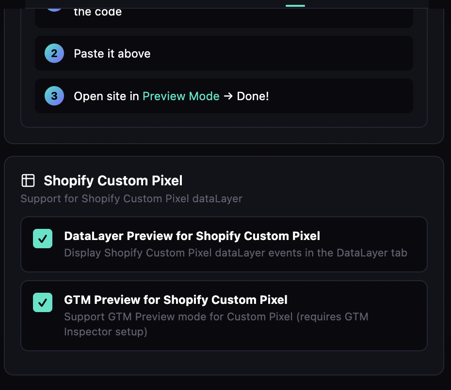

# 🎯 Insighter Pro

**The Ultimate Marketing & Analytics Debugging Tool**

  

---

## 📖 About

Insighter Pro is the most comprehensive Chrome extension for debugging marketing pixels, analytics tracking, and web technologies. With support for **200+ platforms**, it's the only tool you need for tracking validation and debugging.

Perfect for:
- 📈 Digital Marketing Specialists
- 🔧 Analytics Engineers
- 🏷️ Tag Management Consultants
- 💻 Web Developers
- ✅ QA Engineers
- 🏢 Marketing Agencies

---

## 📸 Screenshots

### Pixel Detection (Dark Mode)

*Instantly detect GA4, Google Ads, Meta Pixel, LinkedIn, and more*

### Pixel Detection (Light Mode)

*Beautiful light mode for any preference*

### Real-time Events

*See every tracking event as it fires with full parameters*

### DataLayer Explorer

*Full dataLayer inspection with search and filtering*

### Consent Mode Detection

*Google Consent Mode v1/v2 and CMP detection*

### Storage Manager

*Manage cookies, localStorage, and sessionStorage*

### GTM Injector

*Test Google Tag Manager on any website*

### Shopify Custom Pixel Support

*Full support for Shopify Custom Pixel dataLayer*

### Tech Stack Detection

*Detect 200+ web technologies instantly*

### About Section

*Learn about the team behind Insighter Pro*

---

## 👥 Created By

| Role | Name | Links |
|------|------|-------|
| **Creator & Lead Developer** | Atiqul Islam | [LinkedIn](https://linkedin.com/in/insighteratiqul) • [GitHub](https://github.com/AtiqulIslamRony) |
| **Co-Founder** | Abdul Kader Shimul | [LinkedIn](https://linkedin.com/in/shimul-a-kader) |

### 🙏 Special Thanks
Nadim Mahmud Sizan, Rafiqul Islam Siman, Imran Hossain, Md Abu Sufiyan, Md Zobair

---

## ✨ Features

### 🎯 Pixel Detection (11+ Platforms)
- Google Analytics 4 (GA4)
- Google Tag Manager (GTM)
- Meta Pixel (Facebook)
- Google Ads Conversion Tracking
- TikTok Pixel
- LinkedIn Insight Tag
- Pinterest Tag
- Snapchat Pixel
- Twitter/X Pixel
- Reddit Pixel
- Microsoft Ads (Bing)

### 📊 Real-time Event Inspector
- See every event as it fires
- View all parameters and values
- Filter by event type or platform
- Copy event data with one click

### 📦 DataLayer Explorer
- Full dataLayer inspection
- Real-time updates
- Search and filter entries
- Push custom events for testing
- Expandable nested objects

### 🍪 Storage Manager
- Cookies viewer & editor
- localStorage inspection
- sessionStorage inspection
- Delete or modify values
- Search functionality

### 🔧 Tech Stack Detection (200+ Technologies)
- **Analytics**: Adobe Analytics, Amplitude, Mixpanel, Segment, Heap, PostHog, Matomo
- **Tag Managers**: GTM, Adobe Launch, Tealium iQ, Ensighten
- **Attribution**: Hyros, Triple Whale, CallRail, AppsFlyer, Branch
- **CDPs**: Segment, mParticle, Bloomreach, Treasure Data
- **CMPs**: OneTrust, Cookiebot, TrustArc, Didomi
- **Chat**: Intercom, Drift, Zendesk, Crisp, Gorgias
- **A/B Testing**: Optimizely, VWO, LaunchDarkly, AB Tasty
- **And 150+ more!**

### 🔒 Consent Mode Detection
- Google Consent Mode v1 (GCS) & v2 (GCD)
- 15+ CMP platform detection
- Real-time consent status
- Cookie-based detection

### 💉 GTM Injector
- Test GTM on any website
- No code changes required
- Perfect for audits

### 🔗 UTM Parameter Checker
- Validate campaign parameters
- Check for missing UTMs
- Copy UTM string

### 🌙 Dark & Light Mode
- Beautiful UI in any lighting
- System preference detection
- Manual toggle

---

## 🚀 Installation

### From Chrome Web Store (Recommended)
1. Visit [Chrome Web Store](https://chrome.google.com/webstore)
2. Search for "Insighter Pro"
3. Click "Add to Chrome"

### Manual Installation (Developer Mode)
1. Download the latest release from [Releases](https://github.com/AtiqulIslamRony/insighterpro/releases)
2. Unzip the file
3. Go to `chrome://extensions`
4. Enable "Developer mode" (top right)
5. Click "Load unpacked"
6. Select the unzipped folder

---

## 📋 Supported Platforms

<b>Analytics & Tag Management (35+)</b>

- Google Analytics 4
- Google Tag Manager
- Adobe Analytics
- Adobe Launch
- Adobe Target
- Adobe Audience Manager
- Tealium iQ
- Tealium AudienceStream
- Mixpanel
- Amplitude
- Segment
- Heap
- FullStory
- Hotjar
- Microsoft Clarity
- PostHog
- Matomo
- Plausible
- Pendo
- Kissmetrics
- And more...

<b>Marketing & Advertising (50+)</b>

- Meta Pixel (Facebook)
- Google Ads
- TikTok Pixel
- LinkedIn Insight Tag
- Pinterest Tag
- Snapchat Pixel
- Twitter/X Pixel
- Reddit Pixel
- Microsoft Ads (Bing)
- Amazon Ads
- Taboola
- Outbrain
- Criteo
- AdRoll
- The Trade Desk
- HubSpot
- Klaviyo
- Mailchimp
- ActiveCampaign
- Marketo
- And more...

<b>Attribution & Call Tracking (15+)</b>

- Hyros
- Triple Whale
- Northbeam
- Rockerbox
- Wicked Reports
- CallRail
- CallTrackingMetrics
- Invoca
- AppsFlyer
- Adjust
- Branch
- Kochava
- Singular
- And more...

<b>Consent Management (11)</b>

- OneTrust
- Cookiebot
- TrustArc
- Quantcast Choice
- Didomi
- Sourcepoint
- Usercentrics
- Complianz
- Iubenda
- Termly
- CookieYes

---

## 🛠️ Permissions Explained

| Permission | Why We Need It |
|------------|----------------|
| `activeTab` | Access current tab for scanning |
| `scripting` | Inject detection scripts |
| `storage` | Save your preferences |
| `tabs` | Get tab information |
| `cookies` | Read cookies for analysis |
| `webNavigation` | Detect page navigation |
| `webRequest` | Monitor network requests |

**We do NOT collect any personal data.** All analysis happens locally in your browser.

---

## 📝 Changelog

### v1.0.0 (Initial Release)
- 🎯 200+ platform detection
- 📊 Real-time event monitoring
- 📦 DataLayer explorer with search & filter
- 🍪 Storage manager (cookies, localStorage, sessionStorage)
- 🔒 Consent Mode detection (15+ CMPs, GCS/GCD)
- 💉 GTM injector for testing
- 🔗 UTM parameter checker
- 🌙 Dark/Light mode
- 🎨 Beautiful, professional UI

---

## 💖 Support the Project

If Insighter Pro helps you in your work:

- ⭐ [Star on GitHub](https://github.com/AtiqulIslamRony/insighterpro)
- 🎁 [Support on Patreon](https://patreon.com/insighterpro)
- 📢 Share with colleagues

---

## 🐛 Found a Bug?

Please [open an issue](https://github.com/AtiqulIslamRony/insighterpro/issues) with:
- Browser version
- Steps to reproduce
- Screenshot if possible

---

## 📜 License

**© 2024-2026 Atiqul Islam & Abdul Kader Shimul. All Rights Reserved.**

This is proprietary software. Unauthorized copying, modification, or distribution is strictly prohibited. See [LICENSE](LICENSE) for details.

---

  <b>Built with ❤️ for the Marketing Community</b>

